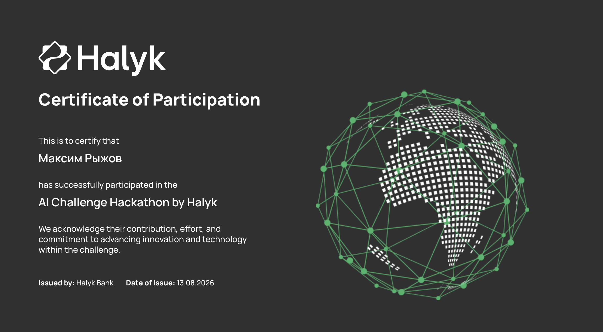

  

  

I turn complex product flows into responsive interfaces, reliable releases,
and evidence a reviewer can inspect.

Open to remote frontend and product engineering roles · UTC+5 ·
[maksimryzhov.ru](https://maksimryzhov.ru) ·
[Portfolio PDF](portfolio/Maksim_Ryzhov_Product_Portfolio.pdf) ·
[Telegram](https://t.me/maksimryzhov614) ·
[Email](mailto:maksryzhov16@gmail.com) ·
[LinkedIn](https://www.linkedin.com/in/maksim-ryzhov-6b0966428/)

Live: [tunika-tkani.ru](https://tunika-tkani.ru/) · [art-square.studio](https://art-square.studio/) · [kalpak.dev](https://kalpak.dev/)

## Product work

  
  

  
  

- **[ART SQUARE STUDIO](https://github.com/maksimryzhov614/maksimryzhov614/blob/main/case-studies/artsquare.md) — multilingual studio site.** Production case study · private source · live product. Next.js site for an architectural scale-model studio: four locales (RU/EN/KY/DE) with enforced copy parity, strict nonce-based CSP, and a 13-check evidence-writing release gate. [Live site](https://art-square.studio/)
- **[kalpak.dev](https://github.com/maksimryzhov614/maksimryzhov614/blob/main/case-studies/kalpak.md) — storefront bureau for Telegram shops.** Production case study · private source · live product. A dark editorial storefront on Next.js RSC and Cloudflare Workers: one real client project, clearly labeled demo concepts, and eight switchable design directions. [Live site](https://kalpak.dev/)
- **[Tunika](https://github.com/maksimryzhov614/maksimryzhov614/blob/main/case-studies/tunika.md) — live commerce platform.** Production case study · private source · live product. Responsive catalog UI, browser media, Go publication, and release safeguards. [Live product](https://tunika-tkani.ru/)
- **[Mansara](https://github.com/maksimryzhov614/maksimryzhov614/blob/main/case-studies/mansara.md) — interactive residential Alpha.** Alpha case study · private source · local demo. A 120-image building turntable, facade/floor exploration, sample apartment journey, and park walkthrough.

## Public tools

  
  

Viewport Sentinel evidence:
[proof run](https://github.com/maksimryzhov614/viewport-sentinel/actions/runs/30814151989) ·
[JSON](https://github.com/maksimryzhov614/viewport-sentinel/blob/main/docs/proof/results.json) ·
[SARIF](https://github.com/maksimryzhov614/viewport-sentinel/blob/main/docs/proof/results.sarif) ·
[v0.1.1](https://github.com/maksimryzhov614/viewport-sentinel/releases/tag/v0.1.1) ·
[npm](https://www.npmjs.com/package/viewport-sentinel/v/0.1.1)

## Certificates

- **[AI Challenge Hackathon by Halyk](assets/certificates/halyk-ai-challenge-hackathon.png)** — Certificate of Participation, issued by Halyk Bank (13.08.2026).

  

## Focus

TypeScript · React · Next.js · JavaScript · Node.js · Go · Playwright · GitHub Actions

## Now

<!-- Refresh this section at least monthly or delete it: a stale "Now" is worse than none. -->

- Shipping ART SQUARE STUDIO releases through its 13-check evidence-writing gate (August 2026).
- Running and maintaining the Tunika production catalog and its fail-closed publication pipeline.
- Building storefront sites for Telegram shops at [kalpak.dev](https://kalpak.dev/).

---

Open to remote frontend and product engineering roles ·
[maksimryzhov.ru](https://maksimryzhov.ru) ·
[Telegram](https://t.me/maksimryzhov614) ·
[Email](mailto:maksryzhov16@gmail.com) ·
[LinkedIn](https://www.linkedin.com/in/maksim-ryzhov-6b0966428/)
