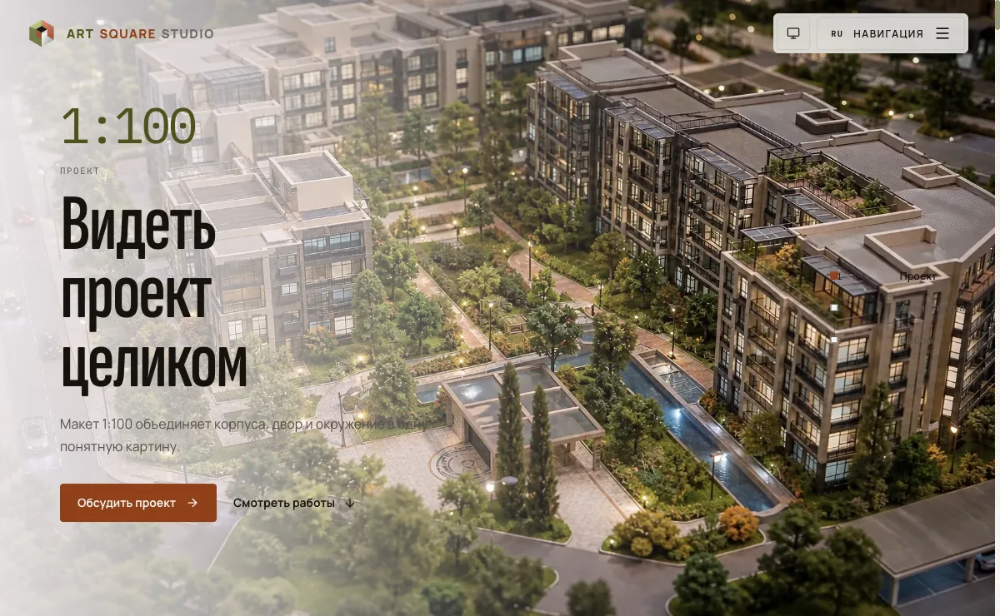
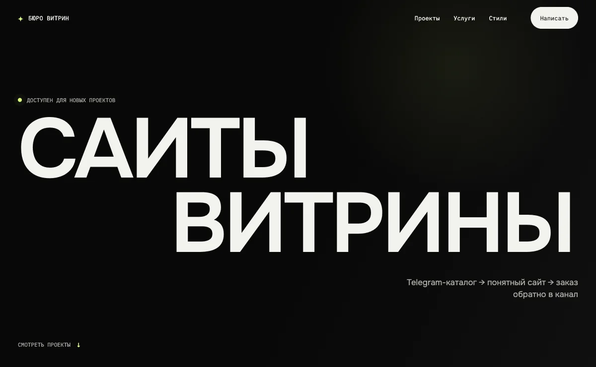
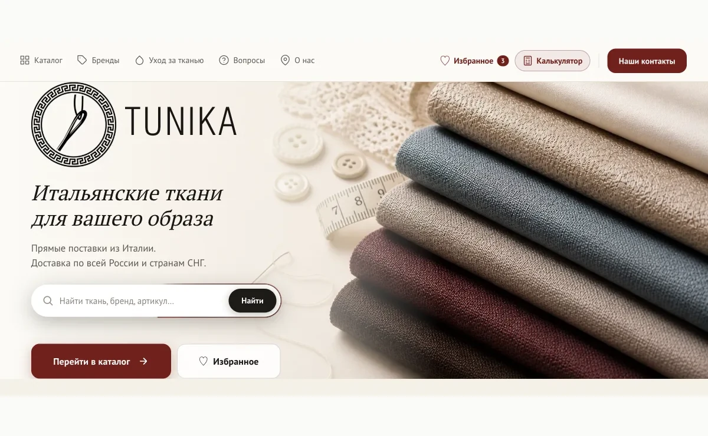
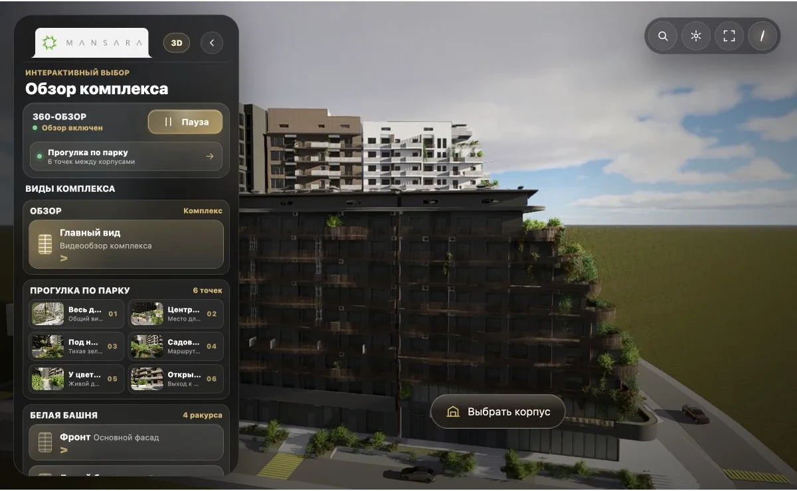

# Maksim Ryzhov

**Frontend Product Engineer**

I turn complex product flows into responsive interfaces, reliable releases,
and evidence a reviewer can inspect.

Open to remote frontend and product engineering roles · UTC+5 ·
[Resume](resume/Maksim_Ryzhov_Frontend_Product_Engineer.pdf) ·
[Telegram](https://t.me/maksimryzhov614)

## Product work

  
  

  
  

- **[ART SQUARE STUDIO](https://github.com/maksimryzhov614/maksimryzhov614/blob/main/case-studies/artsquare.md) — multilingual studio site.** Production case study · private source · live product. Next.js site for an architectural scale-model studio: four locales (RU/EN/KY/DE) with enforced copy parity, strict nonce-based CSP, and a 13-check evidence-writing release gate. [Live site](https://art-square.studio/)
- **[kalpak.dev](https://github.com/maksimryzhov614/maksimryzhov614/blob/main/case-studies/kalpak.md) — storefront bureau for Telegram shops.** Production case study · private source · live product. A dark editorial storefront on Next.js RSC and Cloudflare Workers: one real client project, clearly labeled demo concepts, and eight switchable design directions. [Live site](https://kalpak.dev/)
- **[Tunika](https://github.com/maksimryzhov614/maksimryzhov614/blob/main/case-studies/tunika.md) — live commerce platform.** Production case study · private source · live product. Responsive catalog UI, browser media, Go publication, and release safeguards. [Live product](https://tunika-tkani.ru/)
- **[Mansara](https://github.com/maksimryzhov614/maksimryzhov614/blob/main/case-studies/mansara.md) — interactive residential Alpha.** Alpha case study · private source · local demo. A 120-image building turntable, facade/floor exploration, sample apartment journey, and park walkthrough.
## Public tools

- **[Viewport Sentinel](https://github.com/maksimryzhov614/viewport-sentinel)** — deterministic Chromium checks for responsive, image, and runtime regressions with JSON/SARIF output. [Proof run](https://github.com/maksimryzhov614/viewport-sentinel/actions/runs/30814151989) · [JSON](https://github.com/maksimryzhov614/viewport-sentinel/blob/main/docs/proof/results.json) · [SARIF](https://github.com/maksimryzhov614/viewport-sentinel/blob/main/docs/proof/results.sarif) · [v0.1.1](https://github.com/maksimryzhov614/viewport-sentinel/releases/tag/v0.1.1) · [npm](https://www.npmjs.com/package/viewport-sentinel/v/0.1.1)
- **[Hermes Agent for VS Code](https://github.com/maksimryzhov614/hermes-vscode)** — a review-first client for a self-hosted agent bridge with file, selection, screenshot, and code-edit context.

## Focus

TypeScript · React · Next.js · JavaScript · Node.js · Go · Playwright · GitHub Actions
